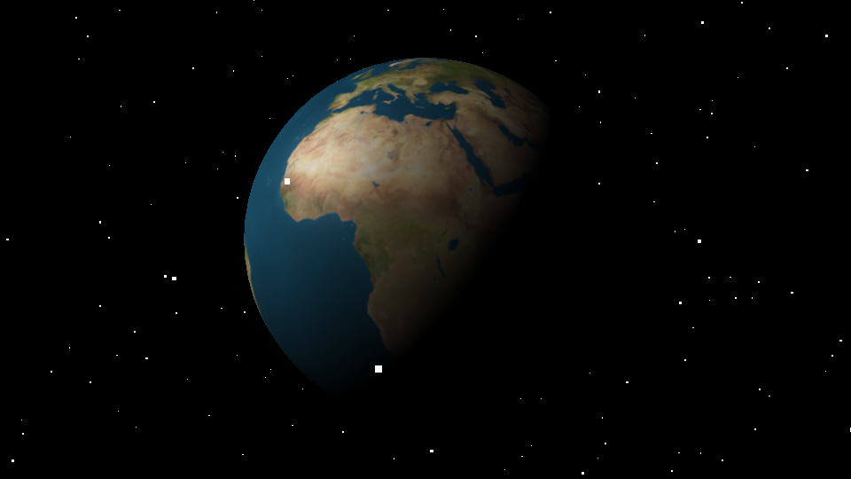
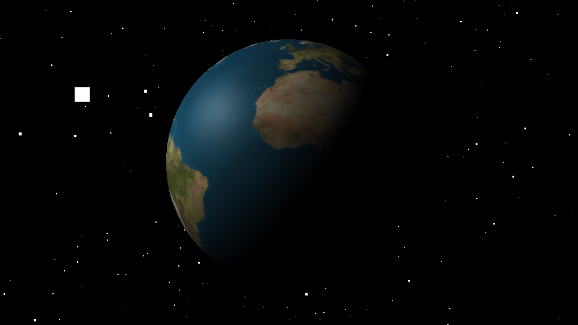

# Three.jsのカメラの制御

3D空間の視点となるカメラについて説明します。3Dには視点を制御するカメラという概念があります。カメラの動かし方を抑えれば表現の自由度が上がります。

## カメラの制御を体験


- [デモを試す](https://ics.media/wp-content/data-demos/140930_angularjs_away3d/src/index.html)

このデモでは**スライダーによって、カメラの位置と角度を制御できるようにしています**。「Camera Position」(座標)のXYZのそれぞれのスライダーを変更すると、カメラの位置が移動し地球の見え方が変わります。「Camera LookAt」(注視点)のトグルをONに設定しているので、常に3D空間の原点をカメラを向くように設定していますが、「Camera LookAt」のトグルを解除すると、自由にカメラの角度を変更できるようになります。カメラの角度にもXYZの3方向があり、それぞれの角度を変更することで見え方が変わります。


Three.jsはこのように3D空間内でカメラ(視点)を自由に移動・回転することができます。これを習得することで**3Dの表現力が格段に高まります**ので、本記事では理解が深まるようにカメラの動かし方を3分類に分け、順を追って説明していきます。

* 自動回転型
* マウスの位置連動型
* マウスのドラッグ＆ドロップ型

## 地球を中心としてカメラを回転させる



- [サンプルを再生する](https://ics-creative.github.io/tutorial-three/samples/camera_basic_earth.html)
- [サンプルのソースコードを確認する](../samples/camera_basic_earth.html)


このサンプルでは地球を中心として**カメラが円周上を自動的に移動**します。カメラの位置の設定は`camera`オブジェクトの`position`プロパティーに数値を代入します。


```js
// ラジアンに変換する
const radian = rot * Math.PI / 180;
// 角度に応じてカメラの位置を設定
camera.position.x = 1000 * Math.sin(radian);
camera.position.z = 1000 * Math.cos(radian);
```

カメラは今回は常に中央を見るようにしておきたいので、`camera`オブジェクトの`lookAt()`メソッドを使って原点座標(0,0,0)を指定しています。`lookAt()`メソッドはどの位置からでも指定した座標に強制的に向かせることができる命令です。

```js
// 原点方向を見つめる
camera.lookAt(new THREE.Vector3(0, 0, 0));
```


動きの演出については、フレーム毎に衛星の配置角度を0.5度ずつ加算し、それをカメラの座標に変換しています。カメラの座標は三角関数(sinとcos)を使って、角度から求めています。1000という値は円の半径です。

```js
view.camera.x = 円周の半径 * Math.sin(角度 * Math.PI / 180);
view.camera.z = 円周の半径 * Math.cos(角度 * Math.PI / 180);
```


## マウスの座標に応じて回転させる




- [サンプルを再生する](https://ics-creative.github.io/tutorial-three/samples/camera_mouse_x.html)
- [サンプルのソースコードを確認する](../samples/camera_mouse_x.html)


このサンプルでは地球を中心として、**マウスの横の移動に対してカメラが移動**します。せっかくのWebGLですのでインタラクティブ性があったほうが面白いですよね。**マウスの位置に応じてカメラの位置を制御する**スクリプトは次となります。(一部抜粋)

```js

let rot = 0; // 角度
let mouseX = 0; // マウス座標

// マウス座標はマウスが動いた時のみ取得できる
document.addEventListener("mousemove", (event) => {
  mouseX = event.pageX;
});

tick();

// 毎フレーム時に実行されるループイベントです
function tick() {
  // マウスの位置に応じて角度を設定
  // マウスのX座標がステージの幅の何%の位置にあるか調べてそれを360度で乗算する
  const targetRot = (mouseX / window.innerWidth) * 360;
  // イージングの公式を用いて滑らかにする
  // 値 += (目標値 - 現在の値) * 減速値
  rot += (targetRot - rot) * 0.02;

  // ラジアンに変換する
  const radian = rot * Math.PI / 180;
  // 角度に応じてカメラの位置を設定
  camera.position.x = 1000 * Math.sin(radian);
  camera.position.z = 1000 * Math.cos(radian);
  // 原点方向を見つめる
  camera.lookAt(new THREE.Vector3(0, 0, 0));

  // レンダリング
  renderer.render(scene, camera);

  requestAnimationFrame(tick);
}
```

ポイントとしては、**角度の算出方法をステージの幅の何％の位置にマウスがあるかを計算で求め、それを角度に反映しているところ**です。その点がStep.1と違うところです。

```js
// マウスの位置に応じて角度を設定
// マウスのX座標がステージの幅の何%の位置にあるか調べてそれを360度で乗算する
const targetRot = (mouseX / window.innerWidth) * 360;
```


なお途中にイージングの公式というのがでてきていますが、Webコンテンツの開発では一般的によく使われる公式なので、知らない方はぜひ覚えておきましょう。

```js
// イージングの公式を用いて滑らかにする
// 値 += (目標値 - 現在の値) * 減速値
rot += (targetRot - rot) * 0.02;
```


## まとめ
今回はカメラの動かし方について、基本的なパターンを演習しました。Three.jsで説明していますが、**類似の3Dフレームワーク(例えば、AwayJSやBabylon.jsなど)でも同じように利用することができます**。今回のチュートリアルではThree.jsの使い方の理解というよりは、3Dの基本的な制御の理解という認識をもっていただければ幸いです。

次は手軽にカメラの操作ができるコントローラーを解説します。

[次の記事へ](camera_orbitcontrols.md)

<article-author>[池田 泰延](https://twitter.com/clockmaker)</article-author>
<article-date-published>2017-11-03</article-date-published>
<article-date-modified>2017-11-06</article-date-modified>