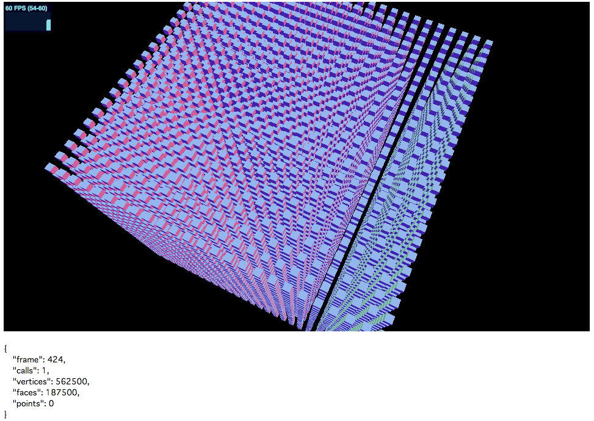
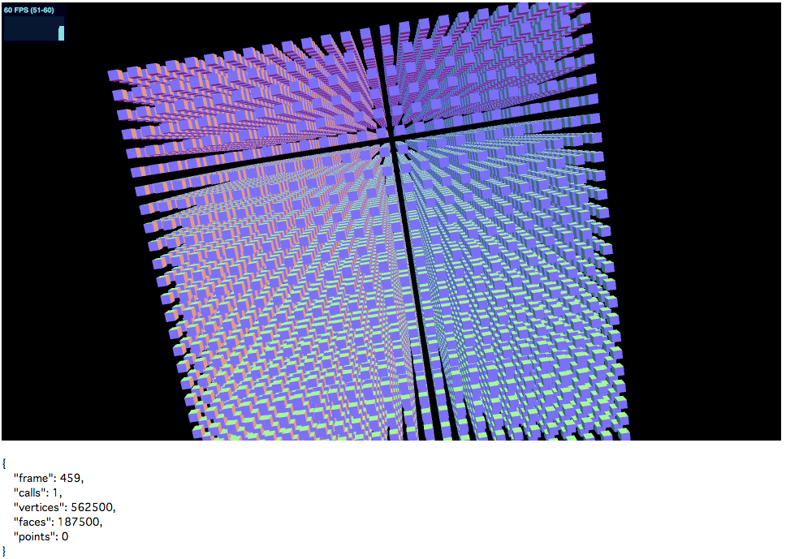

# Three.jsの高速化手法：ジオメトリの結合

Three.jsで大量のオブジェクトを描画するときに役立つ最適化テクニックを紹介します。

## 前提

GPUを用いるコンテンツにおいてドローコール(描画の命令)の回数はパフォーマンスに大きく影響します。ドローコールの回数が少なくすれば、描画の負荷が下がります。これはThree.jsに限らずWebGL・OpenGLの一般的な知識として覚えておいてください。

## サンプルで比較

次の2つのデモの再生を比較してみてください。画面左上にはフレームレートを、画面下側にはドローコール（`calls`が該当する数値）が表示されています。


### 最適化前

最適化前のデモとなります。


- [サンプルを再生する](https://ics-creative.github.io/tutorial-three/samples/geometry_merge_none.html)
- [サンプルのソースコードを確認する](../samples/geometry_merge_none.html)

こちらはカクカクと滑らかに再生できないと思います。ドローコールが8000発生し、フレームレートが約30fps弱となってます。

### 最適化後

次は最適化後のデモとなります。



- [サンプルを再生する](https://ics-creative.github.io/tutorial-three/samples/geometry_merge_mesh.html)
- [サンプルのソースコードを確認する](../samples/geometry_merge_mesh.html)


どうでしょう？ 圧倒的に後者のほうが滑らかに再生できていると思います。
後者のほうは配置している3Dのオブジェクト数が2倍近く多いにもかかわらずです。ドローコールがたった1であり、フレームレートが60fpsとなってます。

最適化によってドローコールの数が激減しています。この手法について解説します。

## Three.jsでのジオメトリの結合

大量の3Dオブジェクトを表示する場合は、3Dオブジェクトのジオメトリ(3D形状における頂点の座標群)を結合することによってGPUに対するドローコールを少なくできます。3Dオブジェクトを一個一個3D空間に追加して表示するよりは、大量の立方体をまとめた巨大な3Dオブジェクトを1個だけ3D空間に追加したほうが負荷が少なくなります。

冒頭の最適化前のデモは一個一個の立方体に対してドローコールが発生しています。`scene`オブジェクトに追加されているメッシュの個数が多いのが特徴です。

▼最適化前のコード

```js
// 1辺あたりに配置するオブジェクトの個数
const CELL_NUM = 20;

// 共通マテリアル
const material = new THREE.MeshNormalMaterial();
// Box
for (let i = 0; i < CELL_NUM; i++) {
  for (let j = 0; j < CELL_NUM; j++) {
    for (let k = 0; k < CELL_NUM; k++) {
      // 立方体個別の要素を作成
      const mesh = new THREE.Mesh(
        new THREE.BoxGeometry(5, 5, 5),
        material
      );

      // XYZ座標を設定
      mesh.position.set(
        10 * (i - CELL_NUM / 2),
        10 * (j - CELL_NUM / 2),
        10 * (k - CELL_NUM / 2)
      );

      // メッシュを3D空間に追加
      scene.add(mesh);
    }
  }
}
```

Three.jsでは、`THREE.Geometry`クラスの`mergeMesh()`メソッドで結合できます。コードは次のように記述します。`scene`オブジェクトに追加されているメッシュはたった1個であることに注目してください。

▼最適化後のコード（1）

```js
// 1辺あたりに配置するオブジェクトの個数
const CELL_NUM = 25;

// 空のジオメトリを作成
const geometry = new THREE.Geometry();

// Box
for (let i = 0; i < CELL_NUM; i++) {
  for (let j = 0; j < CELL_NUM; j++) {
    for (let k = 0; k < CELL_NUM; k++) {
      // 立方体個別の要素を作成
      const meshTemp = new THREE.Mesh(
        new THREE.BoxGeometry(5, 5, 5)
      );

      // XYZ座標を設定
      meshTemp.position.set(
        10 * (i - CELL_NUM / 2),
        10 * (j - CELL_NUM / 2),
        10 * (k - CELL_NUM / 2)
      );

      // メッシュをマージ（結合）
      geometry.mergeMesh(meshTemp);
    }
  }
}

// マテリアルを作成
const material = new THREE.MeshNormalMaterial();
// メッシュを作成
const mesh = new THREE.Mesh(geometry, material);
scene.add(mesh);
```

上記のコードだと、一時的にメッシュを作る必要があるので少し無駄があります。行列`THREE.Matrix4`クラスを扱う知識があれば、次のように`mergeMesh()`メソッドを`merge()`メソッドで置きかけることもできます。どちらでもそれほど大きく性能差は出ませんので、好みの書き方を使ってください。

▼最適化後のコード（2）

```js
// 1辺あたりに配置するオブジェクトの個数
const CELL_NUM = 25;

// 空のジオメトリを作成
const geometry = new THREE.Geometry();

// Box
for (let i = 0; i < CELL_NUM; i++) {
  for (let j = 0; j < CELL_NUM; j++) {
    for (let k = 0; k < CELL_NUM; k++) {
      // 立方体個別の要素を作成
      const sampleGeometry = new THREE.BoxGeometry(5, 5, 5);

      // 座標調整の行列を作成
      const matrix = new THREE.Matrix4();
      matrix.makeTranslation(
        10 * (i - CELL_NUM / 2),
        10 * (j - CELL_NUM / 2),
        10 * (k - CELL_NUM / 2)
      );

      // ジオメトリをマージ（結合）
      geometry.merge(sampleGeometry, matrix);
    }
  }
}

// マテリアルを作成
const material = new THREE.MeshNormalMaterial();
// メッシュを作成
const mesh = new THREE.Mesh(geometry, material);
scene.add(mesh);
```



- [サンプルを再生する](https://ics-creative.github.io/tutorial-three/samples/geometry_merge.html)
- [サンプルのソースコードを確認する](../samples/geometry_merge.html)

## ジオメトリ結合のデメリット

ジオメトリをまとめてしまうと、3Dオブジェクト(Meshのインスタンス)としては一つになります。そのため、個別にマテリアルを設定したりマウスイベントを設定することができなくなります。

インタラクションをしないもの、アニメーションしないものを対象に、このテクニックを適用するといいでしょう。

<article-author>[池田 泰延](https://twitter.com/clockmaker)</article-author>
<article-date-published>2017-11-08</article-date-published>
<article-date-modified>2017-11-08</article-date-modified>