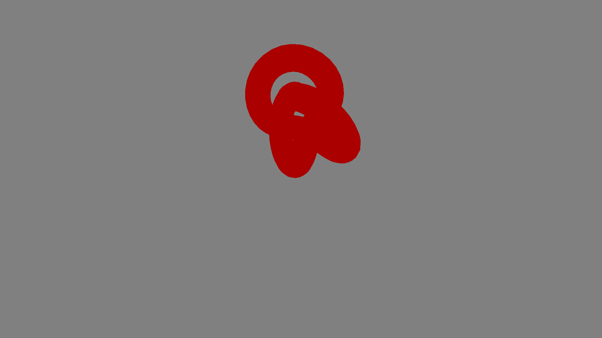
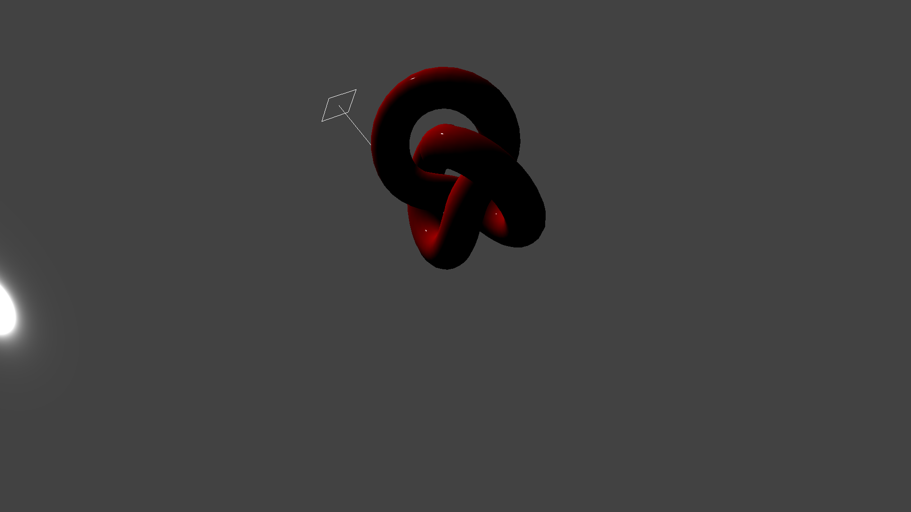
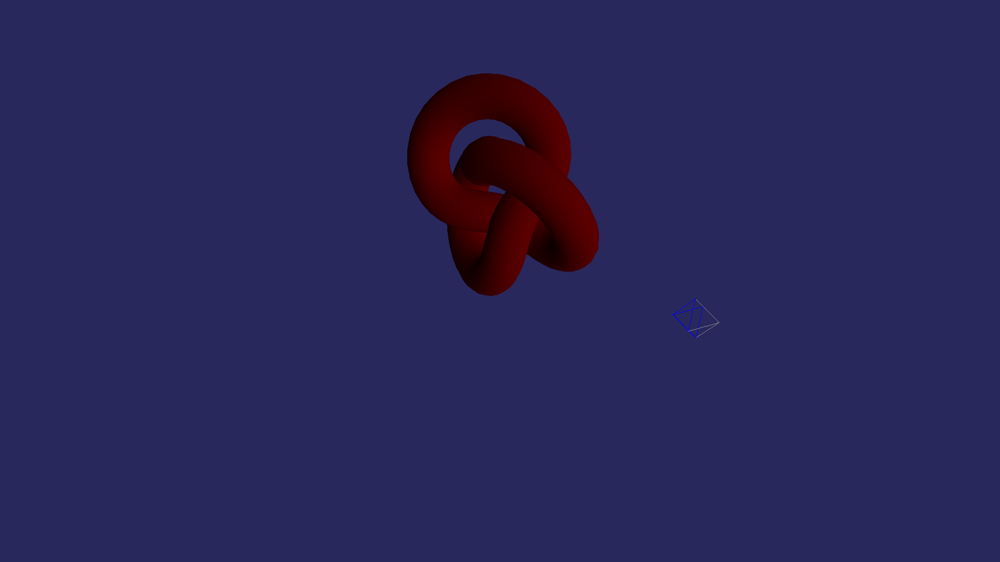
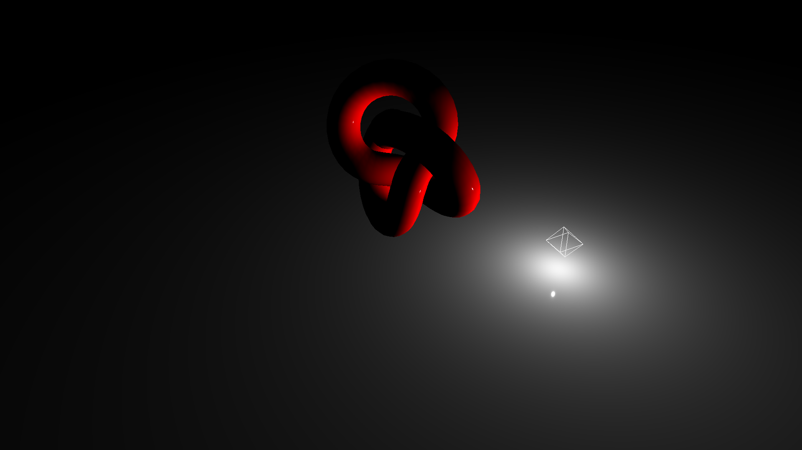
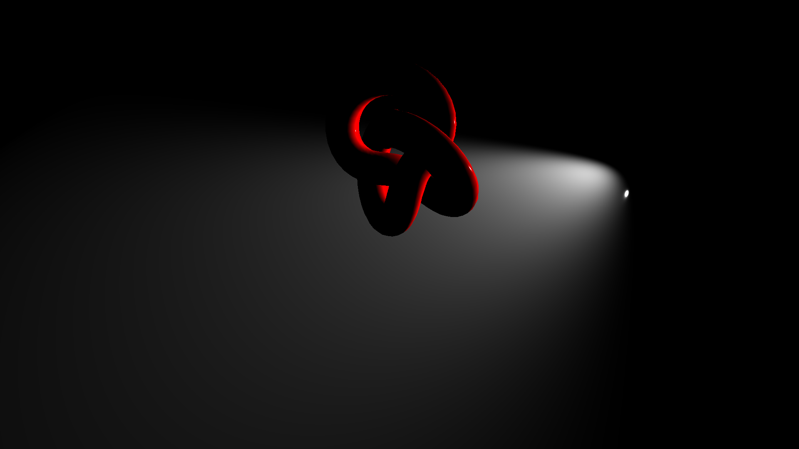
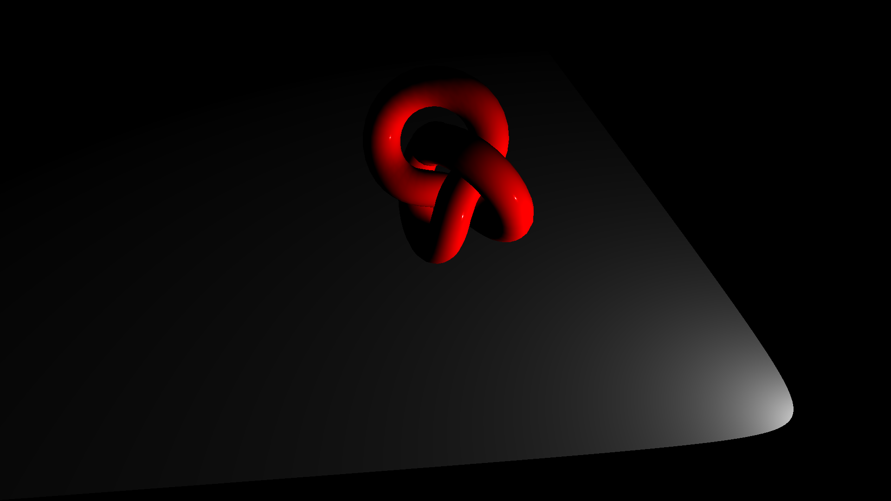
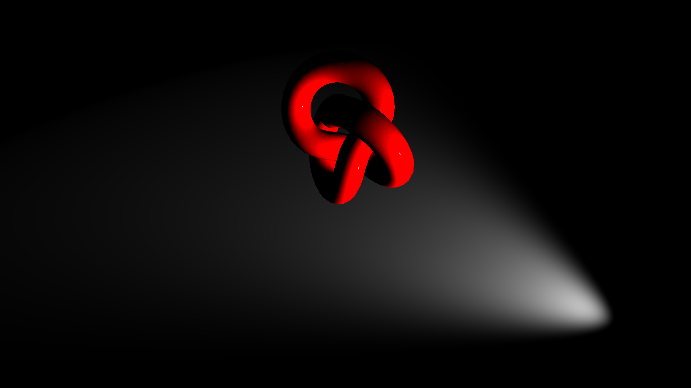
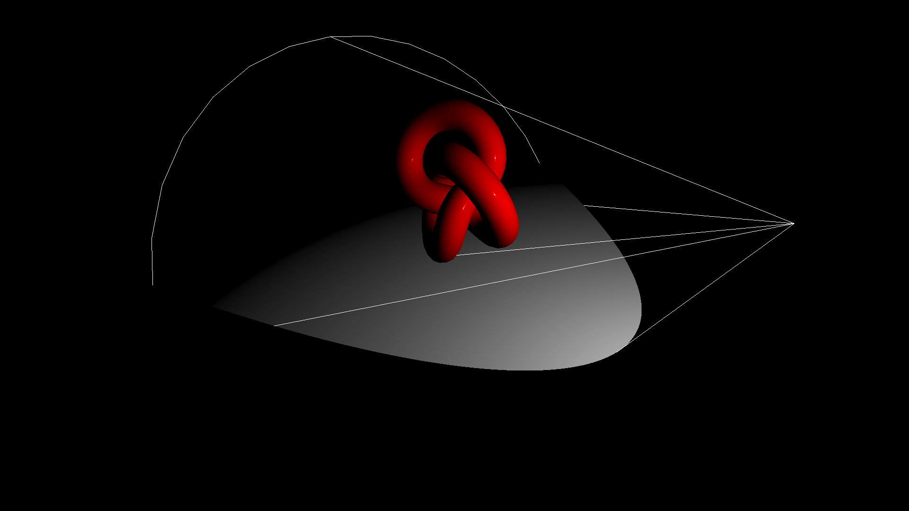
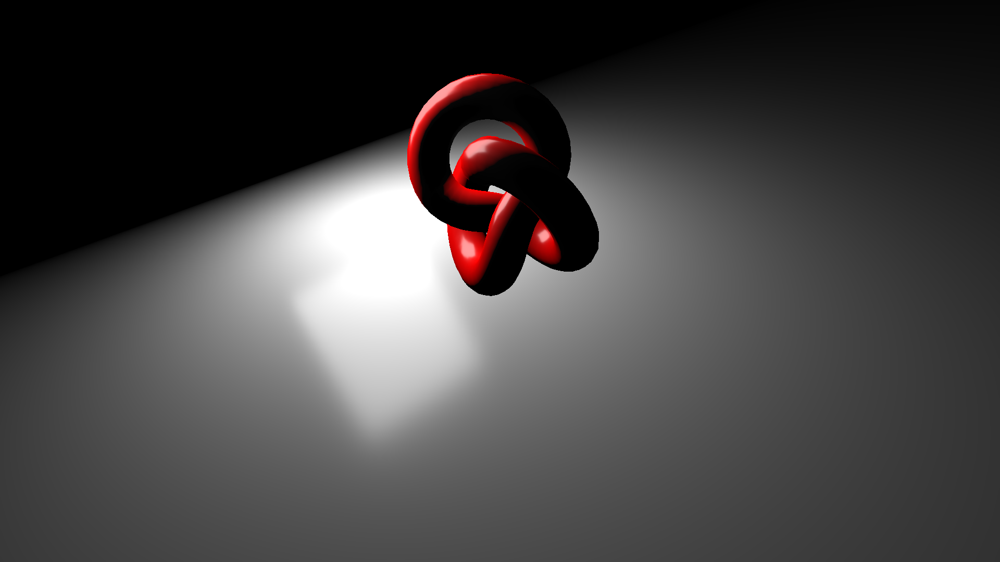

# Three.js ライト機能まとめ

Three.jsには様々なライトが用意されています。

初心者のうちはたくさんの種類があってどれを使うべきか迷いどころです。はじめのうちは、パラメーターの少ない`AmbientLight`や`DirectionalLight`を使い、慣れてきたら`PointLight`や`SpotLight`を使って表現を高めていくのがいいでしょう。


## 環境光源




- [サンプルを再生する](https://ics-creative.github.io/tutorial-three/samples/light_ambient.html)
- [サンプルのソースコードを確認する](../samples/light_ambient.html)


`AmbientLight`クラスは環境光源を実現するクラスです。3D空間全体に均等に光を当てます。一律に明るくしたいときに使うといいでしょう。陰影や影(cast shadow)ができないので、この光源だけだと立体感を表現することはできません。たいてい、他のライトと一緒に利用します。


```js
// 環境光源を作成
// new THREE.AmbientLight(色, 光の強さ)
const light = new THREE.AmbientLight(0xFFFFFF, 1.0);
scene.add(light);
```

詳しい仕様は公式ドキュメント「[AmbientLight](https://threejs.org/docs/#api/lights/AmbientLight)」を参照ください。


## 平行光源



- [サンプルを再生する](https://ics-creative.github.io/tutorial-three/samples/light_directional.html)
- [サンプルのソースコードを確認する](../samples/light_directional.html)


`DirectionalLight`クラスは特定の方向に放射される光。光源は無限に離れているものとして、そこから発生する光線はすべて平行になります。わかりやすい利用例としては、太陽の光です。太陽は地球から遠く離れているので、その位置は無限であるとみなすことができます。太陽から地表に降り注ぐ光線は平行となります。


```js
// 平行光源を作成
// new THREE.DirectionalLight(色, 光の強さ)
const light = new THREE.DirectionalLight(0xFFFFFF, 1);
scene.add(light);
```

詳しい仕様は公式ドキュメント「[DirectionalLight](https://threejs.org/docs/#api/lights/DirectionalLight)」を参照ください。


## 半球光源



- [サンプルを再生する](https://ics-creative.github.io/tutorial-three/samples/light_hemisphere.html)
- [サンプルのソースコードを確認する](../samples/light_hemisphere.html)


`HemisphereLight`クラスは`AmbientLight`クラスに似ていますが、上からの光の色と下からの光の色を分けられます。下からの光は反射光として、屋外での光の見え方に近くなります。

```js
// 半球光源を作成
// new THREE.HemisphereLight(空の色, 地の色, 光の強さ)
const light = new THREE.HemisphereLight(0x888888, 0x0000FF, 1.0);
scene.add(light);
```


詳しい仕様は公式ドキュメント「[HemisphereLight](https://threejs.org/docs/#api/lights/HemisphereLight)」を参照ください。


## 点光源




- [サンプルを再生する](https://ics-creative.github.io/tutorial-three/samples/light_point.html)
- [サンプルのソースコードを確認する](../samples/light_point.html)

`PointLight`クラスは単一点からあらゆる方向から放射される光源です。わかりやすい例としては、裸電球です。裸電球は周辺を明るくします。


```js
// 点光源を作成
// new THREE.PointLight(色, 光の強さ, 距離, 光の減衰率)
const light = new THREE.PointLight(0xFFFFFF, 2, 50, 1.0);
scene.add(light);
```

詳しい仕様は公式ドキュメント「[PointLight](https://threejs.org/docs/#api/lights/PointLight)」を参照ください。


## スポットライト光源



- [サンプルを再生する](https://ics-creative.github.io/tutorial-three/samples/light_spot.html)
- [サンプルのソースコードを確認する](../samples/light_spot.html)

`SpotLight`クラスは、単一の点から一方向に放出され、円錐に沿って放出される光源です。わかりやすい例としては懐中電灯や、ステージのスポットライトを想像するといいでしょう。減衰率や光の方向の指定ができるので、指定できるパラメーターも多いです。たくさん配置すれば立体感・臨場感が生まれます。

```js
// スポットライト光源を作成
// new THREE.SpotLight(色, 光の強さ, 距離, 照射角, ボケ具合, 減衰率)
const light = new THREE.SpotLight(0xFFFFFF, 4, 30, Math.PI / 4, 10, 0.5);
scene.add(light);
```

詳しい仕様は公式ドキュメント「[SpotLight](https://threejs.org/docs/#api/lights/SpotLight)」を参照ください。パラメーターを試せるデモが掲載されてるので、これを使うとイメージしやすいでしょう。


例えば、`exponent`プロパティーの値を変更すると次のように光源が変化します。境界がもやっとした感じに調整できます。







### コラム：ヘルパークラスの利用


ヘルパークラスである`THREE.SpotLightHelper`クラスを使えば、スポットライトの照らしている範囲をワイヤーフレームで可視化できます。



スポットライトはパラメーターが難しいので、ヘルパークラスを利用してシミュレートするといいでしょう。使い方は次のようなコードで実現します。

```js
// スポットライト光源を作成
const light = new THREE.SpotLight(0xFFFFFF, 4, 30, Math.PI / 6, 0, 0.5);
scene.add(light);

// ヘルパーを作成
const lightHelper = new THREE.SpotLightHelper(light);
scene.add(lightHelper);

tick();

// 毎フレーム時に実行されるループイベントです
function tick() {
    // レンダリング
    renderer.render(scene, camera);

    // ヘルパーを更新
    lightHelper.update();

    requestAnimationFrame(tick);
}
```


## 矩形光源



- [サンプルを再生する](https://ics-creative.github.io/tutorial-three/samples/light_rectarea.html)
- [サンプルのソースコードを確認する](../samples/light_rectarea.html)

`RectAreaLight`クラスは、面を横切って矩形平面に均一に放出される光源です。明るい窓やストリップ照明のようなものをシミュレートするために使用できます。

```js
// 矩形光源を作成
// new THREE.RectAreaLight(色, 光の強さ, 幅, 高さ)
const light = new THREE.RectAreaLight(0xFFFFFF, 500, 10, 10);
scene.add(light);
```

詳しい仕様は公式ドキュメント「[RectAreaLight](https://threejs.org/docs/#api/lights/RectAreaLight)」を参照ください。

この光源に関しては[RectAreaLightUniformsLib.js](https://threejs.org/examples/js/lights/RectAreaLightUniformsLib.js)を組み込むと、美しい表示結果が得られます。


<article-author>[池田 泰延](https://twitter.com/clockmaker)</article-author>
<article-date-published>2017-11-11</article-date-published>
<article-date-modified>2017-11-11</article-date-modified>
