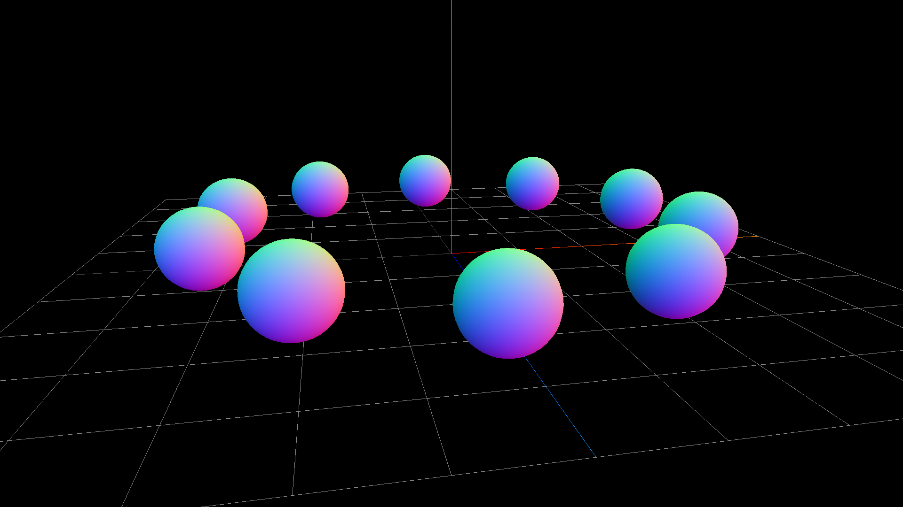

# Three.jsで入れ子構造

Three.jsの3Dオブジェクトはまとめて管理できる機能があります。いわゆる「入れ子構造」として作ることも可能です。入れ子構造として設計することで、複数の3Dオブジェクトをまとめて移動させたり、回転させたりするのが便利になるでしょう。


入れ子構造を作るには`THREE.Object3D`もしくは`THREE.Group`クラスの`add()`メソッドを利用して追加します。逆に入れ子構造から削除したい場合は、`remove()`メソッドを使います。

```js
const wrap = new THREE.Object3D(); 
wrap.add(mesh); // 任意のObject3Dを追加 
scene.add(wrap); 
```

```js
const wrap = new THREE.Group(); 
wrap.add(mesh); // 任意のObject3Dを追加 
scene.add(wrap); 
```

 
一般的にHTML DOMやFlashの表示リストでは親子構造を持った場合、子は親のレイヤー順に依存して表示順が決められていました。しかし3Dでの親子構造は座標の管理だけであり、表示のレイヤー順に関しては影響はありません。表示の影響はあくまでもカメラから見たZ深度の順番となります。 
 
## 3Dの親子構造を試すデモ

3Dの親子構造を理解するために、次のサンプルを試してみてください。10個の平面を円周上に配置し、それらが原点を中心に時計回りに移動するものです。



- [サンプルを再生する](https://ics-creative.github.io/tutorial-three/samples/object_group.html)
- [サンプルのソースコードを確認する](../samples/object_group.html)


まずは親となる`group`インスタンスを作成します。この時点では`group`インスタンスの中身は空っぽです。

```js
// グループを作る
const group = new THREE.Group();
// 3D空間にグループを追加する
scene.add(group);
```


次にこのデモでは`for`文を使用して、10個の球体を作成しています。円周上に並んで配置されるように角度を求め、その角度に応じた位置に配置しています。球体は入れ子構造として配置したいので`group`インスタンスに`add()`メソッドを使用して追加しています。


```js
for (let i = 0; i < 10; i++) {
  // 球体を作成
  const material = new THREE.MeshNormalMaterial();
  const geometry = new THREE.SphereGeometry(30, 30, 30);
  const mesh = new THREE.Mesh(geometry, material);

  // 配置座標を計算
  const radian = i / 10 * Math.PI * 2;
  mesh.position.set(
    200 * Math.cos(radian), // X座標
    30, // Y座標
    200 * Math.sin(radian) // Z座標
  );

  // グループに追加する
  group.add(mesh);
}
```


時間経過では親となる`group`インスタンスを回転させることで、子として配置した10個の球体が円周上を移動します。 

```js
tick();

// 毎フレーム時に実行されるループイベントです
function tick() {
  group.rotation.y += 0.01;

  // レンダリング
  renderer.render(scene, camera);
  requestAnimationFrame(tick);
}
```

## まとめ

入れ子構造は3Dの管理が楽になります。ただグループに入れてしまうとローカル座標とワールド座標をわけて考える場面がでてきます。

詳しくは[ワールド座標](position_world.md)を参照ください。


<article-author>[池田 泰延](https://twitter.com/clockmaker)</article-author>
<article-date-published>2017-11-12</article-date-published>
<article-date-modified>2017-11-12</article-date-modified>
