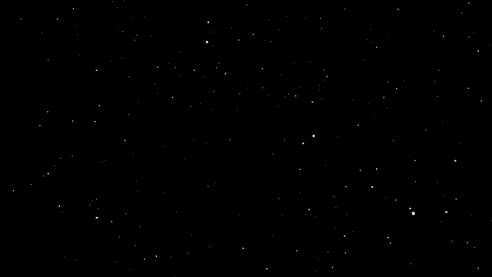

# Three.jsで大量のパーティクルを表示する方法

3D空間内に大量の粒子を表示させたい、星を表示させたい、塵を表示させたい。そんな表現に適しているのが`THREE.Point`クラスです。

この機能を使えば大量の粒子を表示でき、性能的にもすぐ入れているので実行性能をほとんど下げることなく利用できます。

3D空間にたくさんの粒子を配置するだけで、空間の距離感など雰囲気がでるので、オススメの機能の一つです。

## パーティクルのサンプル



- [サンプルを再生する](https://ics-creative.github.io/tutorial-three/samples/points.html)
- [サンプルのソースコードを確認する](../samples/points.html)


## この機能の使い方

この機能を実現する部分を抜粋して解説します。


```js
// 形状データを作成
const geometry = new THREE.Geometry();
// 配置する範囲
const SIZE = 3000;
// 配置する個数
const LENGTH = 1000;
for (let i = 0; i < LENGTH; i++) {
  geometry.vertices.push(new THREE.Vector3(
    SIZE * (Math.random() - 0.5),
    SIZE * (Math.random() - 0.5),
    SIZE * (Math.random() - 0.5),
  ));
}
// マテリアルを作成
const material = new THREE.PointsMaterial({
  // 一つ一つのサイズ
  size: 10,
  // 色
  color: 0xFFFFFF,
});

const mesh = new THREE.Points(geometry, material);
scene.add(mesh);
```


少し長いので難しく思いますが、コードの手順は次の通りです。

### ①空のジオメトリーを作る

```js
// 形状データを作成
const geometry = new THREE.Geometry();
```

### ②ジオメトリーに頂点座標を加えていく

直方体エリア（一辺3000の距離）の中にランダムに1000個の粒子を配置します。`SIZE`と`LENGTH`変数で配置領域や個数をカスタマイズできるので、適宜調整ください。


```js
// 配置する範囲
const SIZE = 3000;
// 配置する個数
const LENGTH = 1000;
for (let i = 0; i < LENGTH; i++) {
  geometry.vertices.push(new THREE.Vector3(
    SIZE * (Math.random() - 0.5),
    SIZE * (Math.random() - 0.5),
    SIZE * (Math.random() - 0.5),
  ));
}
```

### ③専用のマテリアルを作る

`THREE.PointsMaterial`という専用のクラスを使って、粒子のサイズや色を指定します。

```js
// マテリアルを作成
const material = new THREE.PointsMaterial({
  // 一つ一つのサイズ
  size: 10,
  // 色
  color: 0xFFFFFF,
});
```
### ④手順1と3で作成したジオメトリーとマテリアルから、メッシュを作り、3D空間に配置する

```js
const mesh = new THREE.Points(geometry, material);
scene.add(mesh);
```


※ここで出て来た新しいクラスについては、詳しくは公式ドキュメント(英語)の「[Points](https://threejs.org/docs/#api/objects/Points)」と「[PointsMaterial](https://threejs.org/docs/#api/materials/PointsMaterial)」を確認ください。


<article-author>[池田 泰延](https://twitter.com/clockmaker)</article-author>
<article-date-published>2017-11-03</article-date-published>
<article-date-modified>2017-11-03</article-date-modified>