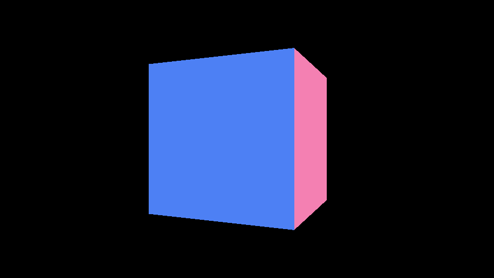

# 簡単な Three.js のサンプルを試そう

[Three.js](http://typescript.Three.js.com/)はHTMLの3D技術「[WebGL](http://ja.wikipedia.org/wiki/WebGL "WebGL - Wikipedia")」を扱いやすくしたフレームワークです。**Three.jsを使えばGPUによる本格的な3D表現をプラグイン無しで作成**できます。


▲Three.jsの公式サイト

ライブラリのセットアップから3D画面への表示および直方体の回転までを紹介します。手順通りに進めば、10分くらいで作業が完了できると思います。



- [サンプルを再生する](https://ics-creative.github.io/tutorial-three/samples/quickstart.html)
- [サンプルのソースコードを確認する](../samples/quickstart.html)

ちなみに前提としてThree.jsはWebGL対応のブラウザが必須となりますので、動作確認はFirefoxやChrome、Safari、Edgeなどを使うといいでしょう。

## canvas要素を用意する

Three.jsはHTML5の`canvas`要素を利用します。`canvas`要素はコンテンツを表示する描画エリアとなります。`canvas`要素には属性として`id`(ID値)を最低限設定しておきましょう。

```html
<body>
  <canvas id="myCanvas"></canvas>
</body>
```

`canvas`要素の大きさは後ほど、JavaScriptで設定します。


## JSライブラリを読み込む


次にJavaScriptライブラリを読み込みます。CreateJSはJavaScriptのライブラリですが、これを読み込むことによってはじめてThree.jsが利用できるようになります。

```html
<script src="https://cdnjs.cloudflare.com/ajax/libs/three.js/88/three.min.js"></script>
```

具体的な処理はページの読み込みが終わってから実行させます。`addEventListener()`関数を使って`load`イベントが発生するのを監視させ、ページが読み込み終わったときに実行させたい関数を指定します。この関数`init()`の中にThree.jsのコードを書いていきます。

```html
<script>
window.addEventListener('load', init);
function init(){
  // 処理
}
</script>
```


## 3D表示用のJavaScriptを用意

ここからは様々な方法がありますが、その中でも私が最も一番手軽だと思う方法を紹介します。コンテンツ用のJSファイルに次のJavaScriptのコードを記述してみましょう。

```html
<!DOCTYPE html>
<html>
<head>
  <meta charset="utf-8"/>
  <script src="https://cdnjs.cloudflare.com/ajax/libs/three.js/88/three.min.js"></script>
  <script>
    // ページの読み込みを待つ
    window.addEventListener('load', init);

    // サイズを指定
    const width = 960;
    const height = 540;

    function init() {
      // レンダラーを作成
      const renderer = new THREE.WebGLRenderer({
        canvas: document.querySelector('#myCanvas')
      });
      renderer.setSize(width, height);

      // シーンを作成
      const scene = new THREE.Scene();

      // カメラを作成
      const camera = new THREE.PerspectiveCamera(45, width / height, 1, 10000);
      camera.position.set(0, 0, +1000);

      // 箱を作成
      const geometry = new THREE.BoxGeometry(500, 500, 500);
      const material = new THREE.MeshPhongMaterial({color: 0xFF0000});
      const box = new THREE.Mesh(geometry, material);
      scene.add(box);

      // 平行光源
      const directionalLight = new THREE.DirectionalLight(0xFFFFFF);
      directionalLight.position.set(1, 1, 1);
      // シーンに追加
      scene.add(directionalLight);

      tick();

      // 毎フレーム時に実行されるループイベントです
      function tick() {
        box.rotation.y += 0.01;
        renderer.render(scene, camera); // レンダリング

        requestAnimationFrame(tick);
      }
    }
  </script>
</head>
<body>
  <canvas id="myCanvas"></canvas>
</body>
</html>
```

ここまでの設定がうまくいっていれば、ブラウザの画面上に単色の直方体が回転します。


このサンプルでは次の手順の処理を実装しています。

1.  ページが読み込まれてから初期化用の関数が実行されるように指定
2.  Three.jsの土台となる`THREE.Scene`, `THREE.Scene`, `THREE.PerspectiveCamera`クラスのインスタンスを作成
3.  直方体の形状を作成し、赤色のマテリアルを指定
4.  時間間経過で関数を呼び出すために`tick`関数を用意
5.  時間経過で回転するように`rotation.y`プロパティの数値を加算
6.  レンダリングを実行

## Three.jsの基本構造

上記のコードで出現した基本的なThree.jsの機能について紹介します。


**THREE.Sceneクラス**

3Dの空間を表すクラス。3Dのオブジェクトはシーンに`add()`メソッドを利用して追加することで表示できます。

**THREE.PerspectiveCameraクラス**

3D空間を撮影するカメラ。視点を制御するために使用します。3D空間のどの視点で撮影しているのかの情報が必要となります。


**THREE.WebGLRendererクラス**

3D空間のレンダリングを行います。レンダリングとは、Three.jsで計算した3Dのオブジェクトを画面に表示することです。内部的にはThree.jsがWebGLのAPIを使って、GPUで座標を計算させ画面に表示させています。Three.jsでは`requestAnimationFrame`のタイミングにあわせて、レンダリングを行うように設定しましょう。


図：Three.jsを構成する基本的なオブジェクトと表示の仕組み  
ビュー(HTMLのcanvasタグ)が実際に表示される画面となります。


## まとめ

3Dと聞くと難しそうと思われがちですが、あっけなく動作したので驚かれた方も多いのではないでしょうか？


次回の記事では、マテリアルやライティングの設定方法を説明します。

[次の記事へ](material_basic.md)


<article-author>[池田 泰延](https://twitter.com/clockmaker)</article-author>
<article-date-published>2017-11-02</article-date-published>
<article-date-modified>2017-11-02</article-date-modified>